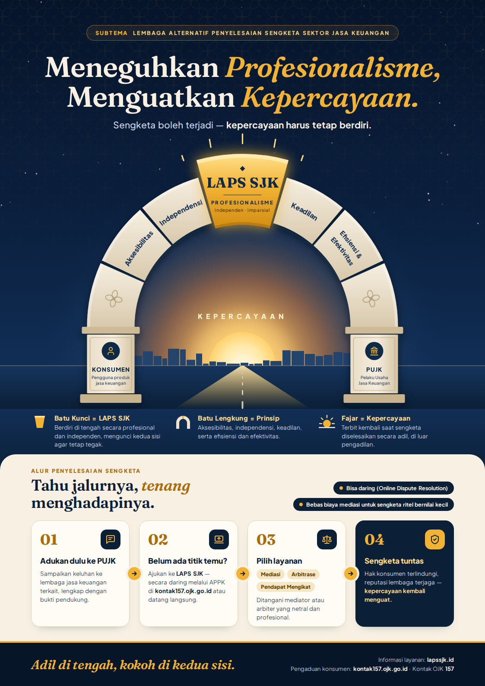

# Poster "Batu Kunci Kepercayaan"

**Tema:** Meneguhkan Profesionalisme, Menguatkan Kepercayaan
**Subtema:** (f) Lembaga Alternatif Penyelesaian Sengketa Sektor Jasa Keuangan



## File

| File | Kegunaan |
| --- | --- |
| `output/poster-A3-300dpi.png` | Untuk diunggah atau dicetak (A3, 3509 × 4959 px, ±300 dpi) |
| `output/poster-A3.pdf` | Siap cetak, A3 (297 × 420 mm), vektor, font tertanam |
| `output/poster-preview.png` | Pratinjau ringan |
| `poster.html` | Sumber desain (HTML + SVG), bisa diedit |
| `render.js` | Membuat ulang file di `output/` |

## Deskripsi karya

Poster ini memakai metafora **batu kunci** (*keystone*), yaitu batu di puncak sebuah
lengkung yang menahan semua batu lainnya. Tanpa batu kunci, lengkung akan runtuh.
Kalau batu kunci terpasang kokoh, kedua sisi lengkung bisa berdiri tegak dan saling menopang.

- **Batu kunci emas = LAPS SJK.** LAPS SJK berdiri di tengah, bersikap profesional,
  independen, dan imparsial. Garis tekan di atasnya menggambarkan batu yang baru saja
  *diteguhkan*, sesuai frasa **"Meneguhkan Profesionalisme"**.
- **Batu lengkung = prinsip LAPS SJK**, yaitu aksesibilitas, independensi, keadilan,
  serta efisiensi dan efektivitas. Semua prinsip ini membentuk struktur yang kuat.
- **Dua tiang = Konsumen dan PUJK.** Keduanya ditopang secara setara, tanpa ada
  yang lebih berat.
- **Fajar di balik lengkung = kepercayaan.** Kepercayaan terbit kembali ketika sengketa
  diselesaikan secara adil di luar pengadilan, sesuai frasa **"Menguatkan Kepercayaan"**.
  Jalan yang menuju cahaya menggambarkan proses penyelesaian yang jelas arahnya.
- **Motif kawung** samar di latar belakang dan pada batu dasar adalah batik Nusantara
  yang dimaknai sebagai lambang integritas dan keadilan. Motif ini memberi identitas
  Indonesia sekaligus menegaskan pesan keadilan.

Bagian bawah poster berisi **alur penyelesaian sengketa** yang edukatif:
(1) adukan dulu ke PUJK, (2) jika belum ada titik temu, ajukan ke LAPS SJK secara daring
melalui APPK atau datang langsung, (3) pilih layanan Mediasi, Arbitrase, atau Pendapat
Mengikat, (4) sengketa tuntas dan kepercayaan menguat. Poster ditutup dengan slogan
*"Adil di tengah, kokoh di kedua sisi."*

**Warna:** biru tua melambangkan profesionalisme dan stabilitas, emas melambangkan
nilai dan kepercayaan, dan krem batu melambangkan keteguhan.
**Tipografi:** Fraunces (judul) dan Plus Jakarta Sans (teks), keduanya berlisensi
SIL Open Font License. Seluruh ilustrasi digambar sendiri dengan SVG, tanpa foto
atau aset stok.

## Mengedit dan membuat ulang

Ubah teks di `poster.html`, lalu jalankan:

```bash
NODE_PATH=$(npm root -g) node poster/render.js
```

Perintah ini membutuhkan Playwright dengan Chromium.
