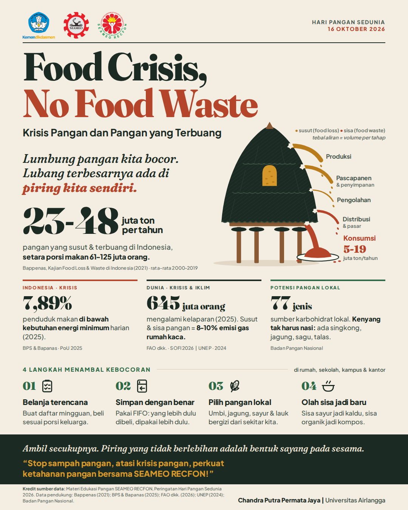

# Infografis "Lumbung yang Bocor" — SEAMEO RECFON World Food Day Contest 2026

Tema: **Food Crisis, Food Waste** · Format: feed Instagram 4:5 (1080 × 1350 px)



## Isi folder

| Path | Isi |
|---|---|
| [`KONSEP-LENGKAP.md`](KONSEP-LENGKAP.md) | Riset dan sumber data, 10 konsep, 3 konsep pilihan, pengembangan, copywriting, storyboard, art direction, prompt/brief ilustrasi, checklist |
| `output/infografis-final-1080x1350.png` | Desain final ukuran feed |
| `output/infografis-final-2160x2700.png` | Desain final resolusi tinggi (2×) |
| `output/infografis-wireframe-1080x1350.png` | Peta tata letak: grid 12 kolom, zona Bagian 1–5 naskah panitia, dan koordinat |
| `design/infografis.html` | Sumber desain (HTML + SVG) |
| `design/fonts/` | Fraunces & Plus Jakarta Sans (SIL Open Font License) |
| `design/logos/` | Tempat file logo resmi dari juknis |
| `scripts/render.mjs` | Render HTML → PNG dengan Playwright/Chromium |

## Sebelum dikirim

- [ ] **Cek juknis soal AI.** Ringkasan ketentuan publik menyebut karya harus buatan manusia dan dilarang memakai AI. Kalau benar, jangan kirim PNG ini. Kerjakan ulang desainnya sendiri memakai `KONSEP-LENGKAP.md` dan wireframe sebagai brief.
- [x] 3 logo resmi sudah terpasang (dari file kiriman peserta). Cocokkan sekali lagi dengan versi di link juknis.
- [x] Nama & instansi: Chandra Putra Permata Jaya | Universitas Airlangga.
- [ ] Buka URL sumber di `KONSEP-LENGKAP.md` (Tahap 1), terutama angka PoU 7,89% di tabel BPS.

## Render ulang

```bash
npm install
node scripts/render.mjs --nama "Chandra Putra Permata Jaya" --instansi "Universitas Airlangga"
node scripts/render.mjs --mode wireframe
```
Jika Chromium untuk Playwright belum terpasang di komputer, jalankan dulu `npx playwright install chromium`.
